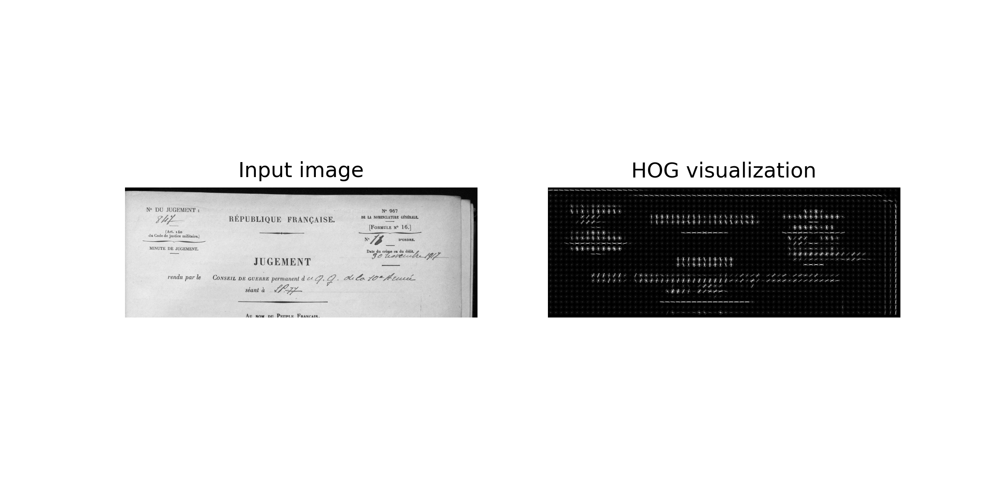
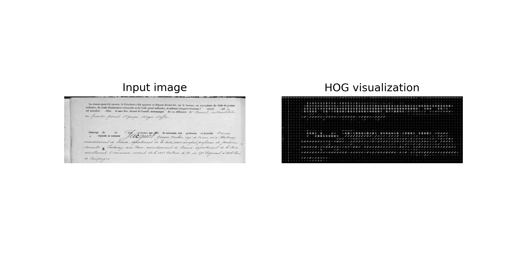
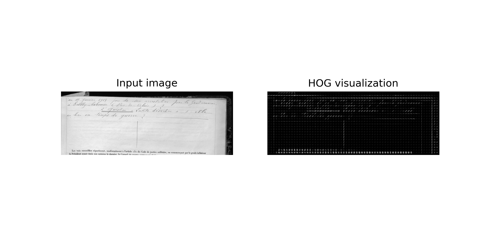
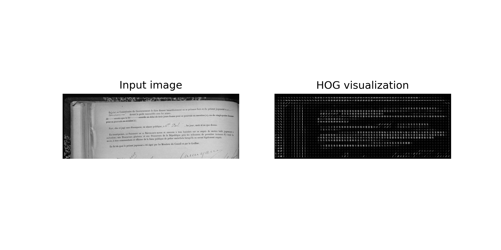

# Chaîne de traitement de FRONT_JUSTICE

## Page classification using Random Forests

The dépôt vise à classifier automatiquement 
les pages des minutes de procès militaires de la Première Guerre Mondiale, 
afin d'en améliorer le traitement ultérieur.

Le but est d'adapter les modèles et les outils pour traiter chaque partie des minutes

### Image processing

The image is converted to grayscale and cropped. 
Only the top 1/4 of the page is kept: the information contained in the
first quarter of the page is enough for an efficient classification.
 It is finally resized to an arbitrary size (1062, 391).

### Feature detection

A Histogram of Oriented Gradients (HOG) is used to identify the
main features of the page. It captures the different layouts and in particular
the different lines of the page and at the opposite the unfilled blanks. 

The corpus is made of 139 images, divided in 5 classes:
- page 1
- page 2
- page 3
- page 4
- page other

The Random Forest is efficient enough to achieve almost 99% of accuracy on the test set.

## Identification du nom du soldat dans la première page

La zone du nom du soldat est difficilement identifiée (à vérifier)
par kraken. Par ailleurs, elle est une information précieuse car elle permet de savoir
s'il y a un ou deux soldats concernés par le jugement. Cette information est relativement
facilement repérable étant donné que la graphie change (changement de module de l'écriture, 
trait plus large).

On utilise donc une détection par classification et fenêtre glissante, 
toujours à l'aide d'un Random Forest.

### Production du corpus

On prend le corpus de pages 1, et on annote seulement les signatures. 

Puis on va découper le corpus en tuiles et classifier en True/False selon 
qu'elles chevauchent les labels produits par page, ce qui donne un corpus d'environ 1500 images:
- 450 True
- le reste en False, avec un équilibrage à tester. 

Le premier modèle donne une exactitude de 0.88.

### Prédiction

On utilise le même système de fenêtre glissante, et on produit une heatmap. 
Déterminer 